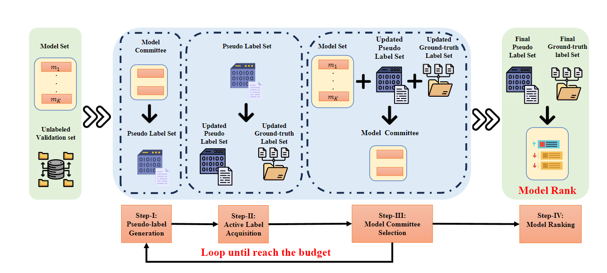

This folder contains the current algorithms and framework that use MoraBench.

### 1. LEMR(**L**abel-**E**fficient **M**odel **R**anking)

[How Many Validation Labels Do You Need? Exploring the Design Space of Label-Efficient Model Ranking](https://arxiv.org/abs/2312.01619).

LEMR is a novel framework that minimizes the need for costly annotations in model selection by strategically annotating instances from an unlabeled validation set.

This is the framework of our LEMR:

<h1 style="text-align:center">

</h1>

```
@article{hu2023many,
  title={How Many Validation Labels Do You Need? Exploring the Design Space of Label-Efficient Model Ranking},
  author={Hu, Zhengyu and Zhang, Jieyu and Yu, Yue and Zhuang, Yuchen and Xiong, Hui},
  journal={arXiv preprint arXiv:2312.01619},
  year={2023}
}
```
